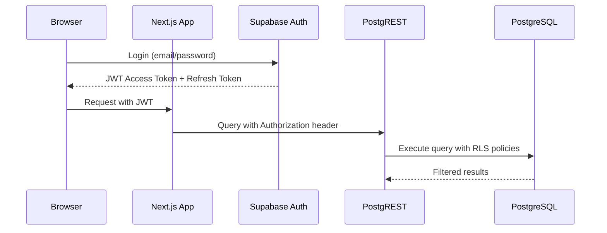

# Crewgrid

**Contact & Access Management System for Crew Operations**

---

## Overview

Crewgrid is a web-based contact management system designed for crew operations, featuring:

- **Role-Based Access Control (RBAC)** - Administrator, Manager, Mitarbeiter roles with granular permissions
- **Row-Level Security (RLS)** - Database-level access controls ensuring users only see their own data
- **License Management** - Concurrent session limits per role and license type  
- **Multi-Entity Contacts** - Support for persons, companies, and venues in unified database
- **Secure Authentication** - JWT-based sessions with refresh tokens

---

## Architecture

```
┌─────────────┐     ┌──────────────┐     ┌──────────────┐
│   Next.js   │◄───►│   PostgREST  │◄───►│ PostgreSQL   │
│   App       │     │   API        │     │   Database   │
└─────────────┘     └──────────────┘     └──────────────┘
       ▲                    │                    │
       │                    ▼                    │
    Browser            Supabase Auth         RLS Policies
```

### Components

| Component | Technology | Purpose |
 `app/`        | Next.js App Router   | Frontend UI & Server Actions |
│ `api/auth/*`  | Next.js Routes      | Authentication endpoints     |
│ Docker        | PostgreSQL 15.4      | Production database          |
│ PostgREST     | v11.x                | REST API layer with RLS      |

---

## Quick Start

### Development Setup

```bash
# 1. Clone and install dependencies
git clone <repository>
cd crewgrid
npm install

# 2. Configure environment
cp .env.example .env.local
# Edit .env.local with your Supabase credentials

# 3. Run development server
npm run dev
```

### Local Docker Development

```bash
# Start database and API services only
docker-compose -f docker-compose.yml up -d db api

# Apply schema migration
docker exec crewgrid_db psql -U postgres -d crewgrid -f supabase/schema_v2.sql

# Run security tests
node scripts/security-test.js
```

---

## Security Features

### Authentication Flow



### Role Hierarchy & Permissions

| Role | Max Sessions | Can View Own | Can Edit Own | Can View Others | Admin Actions |
 Administrator | 999 | ✅ | ✅ | ✅ | ✅ (Full access) |
│ Manager      | 5   | ✅ | ✅ | ✅ (Team only) | ⚠️ Limited   |
│ Mitarbeiter  | 3   | ✅ | ✅ | ❌ | ❌ None        |

### Database Row-Level Security

```sql
-- Contacts table RLS policies
CREATE POLICY "Contacts select by owner" ON contacts FOR SELECT USING (
    id IN (SELECT contact_id FROM users WHERE jwt_sub = current_setting('request.jwt.claims.sub'))
);

CREATE POLICY "Contacts update by owner" ON contacts FOR UPDATE USING (
    id IN (SELECT contact_id FROM users WHERE jwt_sub = current_setting('request.jwt.claims.sub'))
);
```

---

## Project Structure

```
crewgrid/
├── app/                          # Next.js application
│   ├── actions/                  # Server Actions
│   ├── api/auth/                 # Authentication routes
│   │   ├── licenses/route.ts     # License management
│   │   ├── logout/route.ts       # Session termination
│   │   ├── refresh/route.ts      # Token refresh
│   │   └── session-status/       # Validation endpoint
│   └── crewgrid/                 # Main application pages
├── components/                   # Reusable UI components
│   └── AuthOverlay.tsx           # Authentication overlay
├── lib/                          # Utilities & helpers
│   ├── auth-helpers.ts           # JWT utilities
│   └── supabase/client.ts        # Supabase client config
├── middleware/                   # Next.js middleware
│   └── middleware.ts             # Route protection
├── scripts/                      # Automation scripts
│   ├── create-test-data.js       # Test data generation
│   └── security-test.js          # Penetration testing suite
├── supabase/
│   └── schema_v2.sql             # Database schema & RLS policies
├── docker-compose.yml            # Local development environment
├── .npmrc                        # npm configuration (min-release-age=7d)
└── docs/
    ├── SECURITY-TESTING.md       # Security test documentation
    └── SECURITY-TEST-HANDOFF.md  # Assessment handoff notes
```

---

## Environment Variables

| Variable | Description | Required |
 JWT_SECRET                    | Secret key for JWT signing (min 32 chars) | Yes      |
│ SUPABASE_URL                | Supabase project URL                      | Yes      |
│ NEXT_PUBLIC_SUPABASE_ANON_KEY   | Anonymous/public key                  | Yes      |
│ SUPABASE_SERVICE_ROLE_KEY         | Service role key (server-side)    | Yes      |
│ DB_PASSWORD                       | Database password                     | No*      |

*Required only for local Docker development

---

## Testing

### Security Test Suite

```bash
# Run all security tests
node scripts/security-test.js

# Tests include:
# - RLS Bypass Detection
# - IDOR (Insecure Direct Object Reference)
# - Authentication Bypass
# - JWT Secret Validation  
# - Route Protection
# - SQL Injection Prevention
# - XSS Prevention
```

### Manual Testing Checklist

- [ ] Unauthenticated user cannot access `/crewgrid` routes
- [ ] User can only read their own contact records  
- [ ] User cannot modify another user's contact via API
- [ ] JWT token forgery is prevented with proper secret length
- [ ] Session tokens expire correctly
- [ ] Concurrent session limits are enforced per role

---

## Deployment

### Production Checklist

**Security Configuration:**
- [ ] Set strong `JWT_SECRET` (minimum 32 characters, use `openssl rand -base64 32`)
- [ ] Use environment-specific keys for dev/staging/prod
- [ ] Enable HTTPS on all endpoints
- [ ] Configure CORS appropriately

**Database Setup:**
```bash
# Apply schema to production database
psql -h <host> -U <user> -d <database> -f supabase/schema_v2.sql
```

**PostgREST Configuration:**
- Set `PGRST_JWT_SECRET` matching your JWT_SECRET
- Configure `PGRST_DB_ANON_ROLE` for public queries
- Enable RLS on all sensitive tables

---

## Contributing

See [CONTRIBUTING.md](.github/CONTRIBUTING.md) for guidelines.

---

**Built with Next.js, Supabase, PostgreSQL, and PostgREST**

*Last updated: June 2026*
